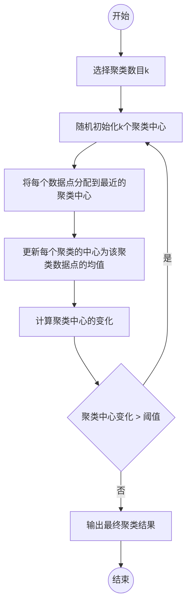

##

# K-means算法

## 1. 简要思路与图示

### 简要思路

K-means是一种非常经典且简单的聚类算法。它的目的是将n个观察点划分到k个聚类中，使得每个观察点属于离它最近的均值（即聚类中心）对应的聚类。K-means算法采用迭代方式更新聚类中心，直到算法收敛。

### 图示

## 2. 主要步骤和公式说明

### 主要步骤

1. 初始化：随机选择k个观察点作为初始聚类中心。
2. 迭代更新： a. 将每个观察点分配到离它最近的聚类中心。 b. 更新每个聚类中心为分配给该聚类的观察点的均值。
3. 重复步骤2，直到聚类中心不再发生显著变化。

### 公式说明

分配观察点到最近的聚类中心的公式如下：

$c_i = \arg\min\limits_{c \in \{1, 2, \cdots, k\}} d(x_i, \mu_c)$

其中，$c_i$表示第$i$个观察点$x_i$所属的聚类，$\mu_c$表示第$c$个聚类的中心，$d(x_i, \mu_c)$表示观察点$x_i$与聚类中心$\mu_c$之间的距离。

更新聚类中心的公式如下：

$\mu_c = \frac{1}{n_c} \sum\limits_{x \in C_c} x$

其中，$n_c$表示第$c$个聚类中观察点的数量，$C_c$表示第$c$个聚类的观察点集合。

## 3. 优缺点

### 优点

1. K-means算法简单且易于实现。
2. 计算复杂度较低，适用于大规模数据集。
3. 当数据满足某些假设（如类状分布）时，算法表现较好。

### 缺点

1. 需要预先设定聚类数量k，但在实际应用中k的值通常难以确定。
2. 对初始聚类中心敏感，可能陷入局部最优解。通常需要多次随机初始化以获得更好的结果。
3. 对于非凸数据集或具有不同大小和密度的聚类，K-means算法表现较差。
4. 不适用于离散数据和非数值型数据。

## 4. NLP应用和工程流程

### NLP应用
1. 文档聚类：对大量文本数据进行聚类，以发现相似主题或内容。
3. 文本摘要：将相似的句子聚类，从每个聚类中选择代表性句子作为文本摘要。

### 工程流程

1. 数据预处理：对文本数据进行清洗、分词、去停用词等操作，以提取关键信息。
2. 特征提取：将文本数据转换为数值型特征，例如TF-IDF向量或词嵌入（如Word2Vec、GloVe等）或句向量（如SimCse）。
3. 应用K-means算法：根据实际需求选择合适的k值，运行K-means算法对特征进行聚类。
4. 结果分析：对聚类结果进行可视化和分析，以解释算法发现的潜在结构或主题。

