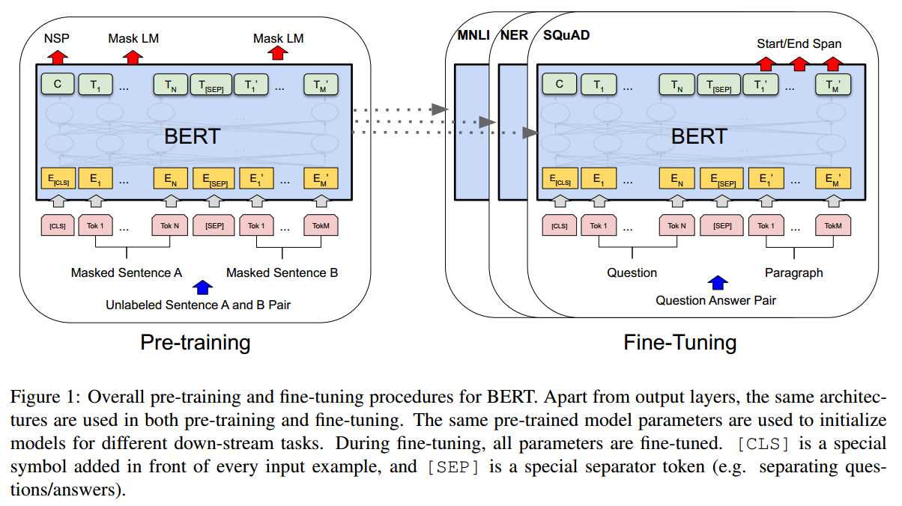
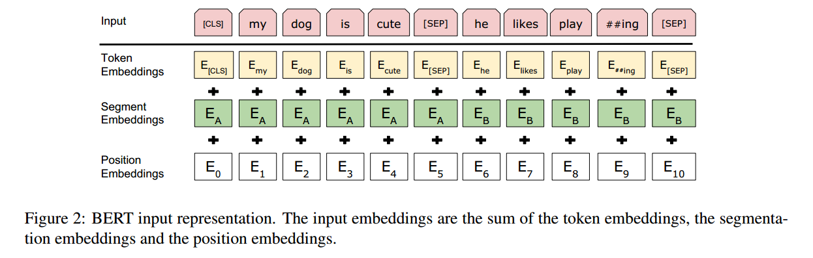
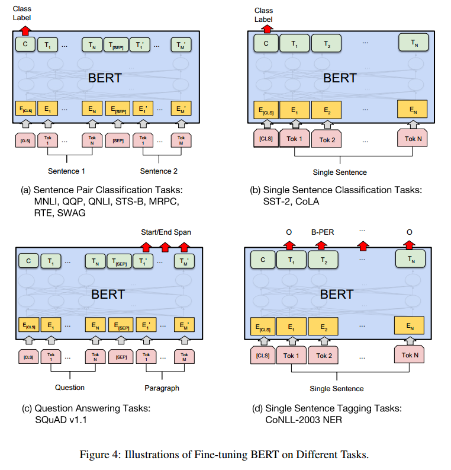

##


> 这篇笔记的重点角度不在于bert的原本论文的内容，更多的在于对NLP发展的角度

# 一，范式改变

1. NLP任务上：从直接微调变成了先预训练然后再微调
2. 模型结构上：确立了attention的地位



# 二，bert特点

## 1.预训练

### a.MLM任务

训练数据生成器会随机选择**15%**的标记位置进行预测。如果第i个标记被选中，我们将其替换为以下**三种情况之一**：(1) **80%**可能性替换成[MASK]；(2) **10%**可能性替换成随机token(3) **10%**可能性保持不变。

### b.NSP任务

当为每个预训练示例选择句子A和B时，有50%的可能性B是紧随A后的真正下一个句子(标记为IsNext),而另外50%的可能性它是语料库中的一个随机句子(标记为NotNext)。

## 2.双向编码器

### a.模型结构

```python
BertModel(
  (embeddings): BertEmbeddings(
    (word_embeddings): Embedding(21128, 768, padding_idx=0)
    (position_embeddings): Embedding(512, 768)
    (token_type_embeddings): Embedding(2, 768)
    (LayerNorm): LayerNorm((768,), eps=1e-12, elementwise_affine=True)
    (dropout): Dropout(p=0.1, inplace=False)
  )
  (encoder): BertEncoder(
    (layer): ModuleList(
      (0-11): 12 x BertLayer(
        (attention): BertAttention(
          (self): BertSelfAttention(
            (query): Linear(in_features=768, out_features=768, bias=True)
            (key): Linear(in_features=768, out_features=768, bias=True)
            (value): Linear(in_features=768, out_features=768, bias=True)
            (dropout): Dropout(p=0.1, inplace=False)
          )
          (output): BertSelfOutput(
            (dense): Linear(in_features=768, out_features=768, bias=True)
            (LayerNorm): LayerNorm((768,), eps=1e-12, elementwise_affine=True)
            (dropout): Dropout(p=0.1, inplace=False)
          )
        )
        (intermediate): BertIntermediate(
          (dense): Linear(in_features=768, out_features=3072, bias=True)
          (intermediate_act_fn): GELUActivation()
        )
        (output): BertOutput(
          (dense): Linear(in_features=3072, out_features=768, bias=True)
          (LayerNorm): LayerNorm((768,), eps=1e-12, elementwise_affine=True)
          (dropout): Dropout(p=0.1, inplace=False)
        )
      )
    )
  )
  (pooler): BertPooler(
    (dense): Linear(in_features=768, out_features=768, bias=True)
    (activation): Tanh()
  )
)
```

- BertEmbeddings：该层对输入进行嵌入（embedding），包括单词嵌入（word_embeddings）、位置嵌入（position_embeddings）和标记类型嵌入（token_type_embeddings），并且使用LayerNorm和Dropout对它们进行标准化和规范化。
- BertEncoder：该层由多个BertLayer组成，每个BertLayer由一个BertAttention层、BertIntermediate层和BertOutput层组成。其中BertAttention层实现了自注意力机制，BertIntermediate层使用全连接层进行维度扩张，BertOutput层再使用全连接层将其压缩回原来的维度，并使用LayerNorm和Dropout进行标准化和规范化。
- BertPooler：该层使用线性层和tanh激活函数生成模型的输出表示，通常用于分类任务。


### b.编码方式

从上面的模型结构也能看出有三个embedding的参数用来查找，然后将三个相加



# 三，下游任务

1. 文本分类可以直接用[CLS]来进行全连接分类，也可以通过取所有字[Token]的池化层然后进行全连接
2. 序列标注可以通过文字本身的[Token]来进行全连接分类组成一个序列的结果
3. 阅读理解则通过预测答案的启末位置作为结果



# 四，各种改进


1. ALBERT（A Lite BERT）：

   - factorized embedding parameterization（词嵌入的因式分解）
   - cross-layer parameter sharing（交叉层的参数共享）
   - sentence-order prediction (SOP，句子顺序预测)

2. RoBERTa（A Robustly Optimized BERT Pretraining Approach）

   -  No NSP and Input Format（去掉NSP任务和ABtoken编码）

   -  更多训练数据/更大的batch size/训练更长时间

   -  Dynamic Masking（一个句子能有多个Musk方式并用于不同的epoch）
   
   -   character-level BPE 改成了 byte BPE

等等各种改进

