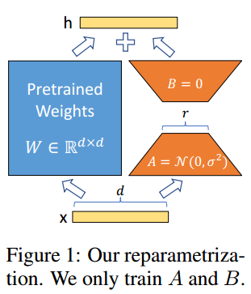
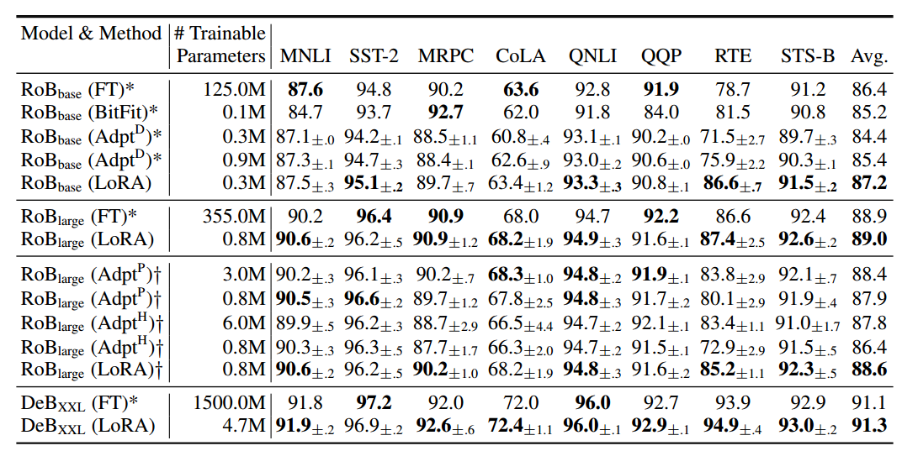
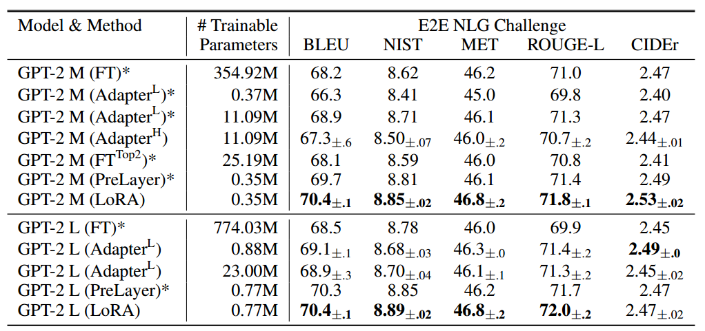
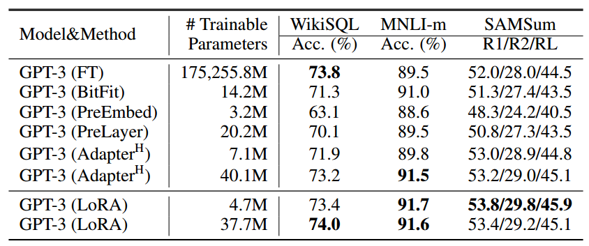
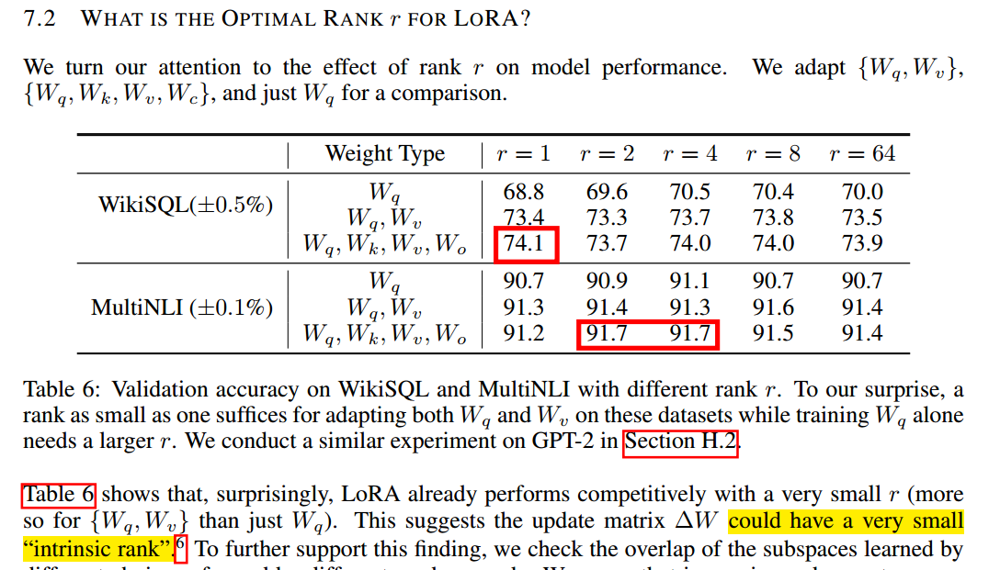

##

# [2106.09685-LORA.pdf]

# 一，现有方法的缺点

1. 通过增加模型的深度或者减少模型的可用序列来减少训练量通常会影响预测的效率
2. 实际情况中，需要在模型效果和训练效率之间权衡

总结，简单说就是不好用，需要考虑的东西比较多而且效果没保证

# 二，LoRA的优点

1. 共享预训练模型：不同任务可以有不同的小型 LoRA 模块
2. 提高训练效率并降低硬件准入门槛：无需训练预训练模型，直接训练LoRA模块
3. 无额外推理延迟：线性层直接加和到预训练的层中
4. 与先前方法相结合：可以跟其他得方法整合一起使用

总结，共享预训练模型、提高训练效率并降低硬件准入门槛、无额外推理延迟以及与先前方法相结合这四个优点

# 三，LoRA方法

假设大的语言模型有低的“内在秩”，通过新的输出公式来增加$BAx$

这个可训练的参数来完成曾经的微调：$h = W_0x + ∆Wx = W_0x + BAx$

特点：

1. 全面微调的泛化：一种更通用的微调方法允许训练预训练参数的一个子集。换句话说，随着我们增加可训练参数的数量，训练 LoRA 大致收敛于训练原始模型，而基于适配器的方法收敛于 MLP，基于前缀的方法收敛于不能处理长输入序列的模型。
2. 无额外推理延迟：在生产环境中部署时，我们可以显式地计算和存储 $W = W_0 + BA$，并像往常一样进行推理。请注意，$W0$ 和$BA$ 都属于 $R^(d×k)$。当我们需要切换到另一个下游任务时，我们可以通过减去 $BA$ 然后添加不同的 $B_0A_0$ 来恢复$W_0$，这是一个快速操作，内存开销非常小。

# 四，结果

> 表2：在 GLUE 基准测试中，使用不同适应方法的 RoBERTabase、RoBERTalarge 和 DeBERTaXXL。我们报告了 MNLI 的总体（匹配和不匹配）准确性，CoLA 的马修斯相关性，STS-B 的皮尔森相关性，以及其他任务的准确性。所有指标中，数值越高越好。*表示之前工作中发布的数字。y 表示在类似于 Houlsby 等人（2019）的设置中进行配置，以便进行公平比较。

> 表3：在 E2E NLG Challenge 中，使用不同适应方法的 GPT-2 medium（M）和 large（L）。对于所有指标，数值越高越好。LoRA 在具有可比或更少可训练参数的几个基线中表现优越。我们列出了我们运行的实验的置信区间。*表示之前工作中发布的数字。

> 表4：不同适应方法在 GPT-3 175B 上的性能。我们报告了 WikiSQL 的逻辑表单验证准确性，MultiNLI-matched 的验证准确性，以及 SAMSum 上的 Rouge-1/2/L。LoRA 的性能优于先前的方法，包括全面微调。WikiSQL 上的结果波动在±0.5%左右，MNLI-m 在±0.1%左右，SAMSum 在三个指标上分别在±0.2/±0.2/±0.1 左右。

# 五，调参经验

> 调参上，r不用太大，太大反而参数量会多，能调的矩阵可以多，相比于少的可调矩阵，多的效果会好一些

