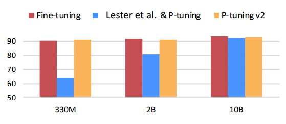
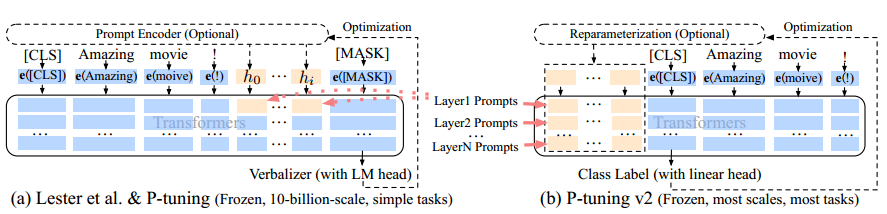
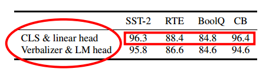
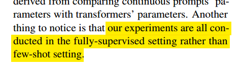
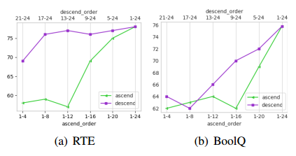

##

[2110.07602v3-P-tuning2.pdf]

# 一、现有方法的缺点

1. 参数量少的时候不能跟微调效果相比

2. 不能处理难得序列标注问题

    

# 二、P-tuning2的优点

1. 有更多的训练参数
2. 训练参数的印象更加直接
3. 参数量小的模型效果跟微调效果相媲美

# 三、P-tuning2方法

> 图2：来自Lester等人（2021）的P-tuning到P-tuning v2。橙色块（即h0，......， hi）指可训练的提示嵌入；蓝色块是由冻结的预训练语言模型存储或计算的嵌入。

1. 多层参数微调，增加微调的参数量
2. 随机初始化CLS&linear head分类任务，替换了原来的Verbalizer&LM head，效果差不多甚至有时候更好
3. 可以用多任务学习给prompt的训练参数初始化

对比表格：

| 特点         | P-tuning 1                    | P-tuning 2                                                 |
| ------------ | ----------------------------- | ---------------------------------------------------------- |
| 提示位置     | 输入嵌入序列中的一个位置      | 在多个 Transformer 层作为前缀 tokens                       |
| 参数调整空间 | 受序列长度限制                | 更多的任务特定参数，更高的参数效率                         |
| 对预测的影响 | 相对间接                      | 更直接地影响模型预测                                       |
| 分类头       | 预测 verbalizers 的语言建模头 | 随机初始化的线性分类头                                     |
| 任务适用性   | 分类、模型参数量大的任务      | 适用于各种 P-tuning1任务，包括序列标注任务，同时适应小模型 |

# 四、部分结果

> 在RoBERTa-large上比较使用带有线性头部的[CLS]标签和使用带有语言模型头部的verbalizer的差异。

# 五、其他有意思的点

1. 这不是少样本任务，是一种全量数据的小参数微调方法
2. 后面层的训练参数相比前面层的训练参数对效果的提升更大
