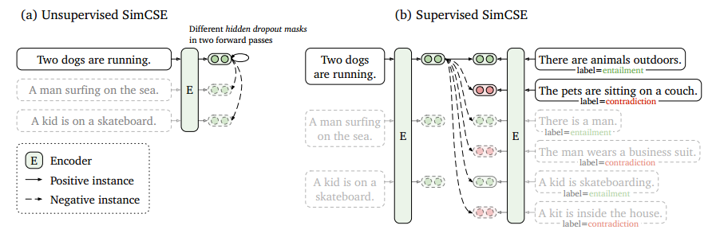
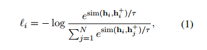
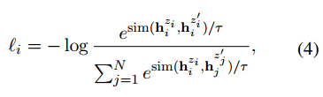
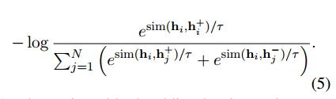
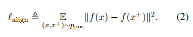
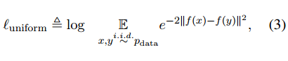
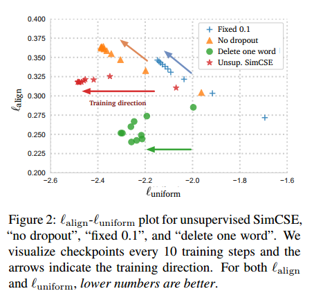
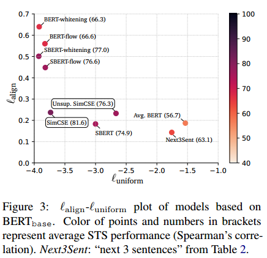
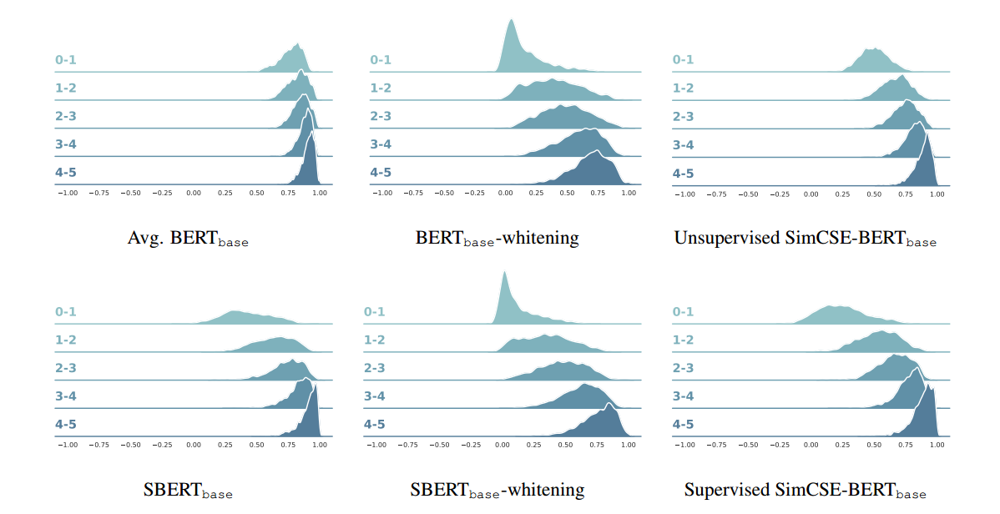

##

> 简单的方法有时候效果奇好

# 一，方法

## 1.对比学习

目标是将相似样本拉近，不相似样本推远，这里主要使用批内负样本来构造交叉熵损失

## 2.无监督

比如一个批次有如下句子：

1. 今天天气不错
2. 明天天气很好
3. 后天依然很棒

假设"今天天气不错"为$z_i$，我们利用dropout的方法生成$z_i^`$，

其他的两句的dropout数据就是$z_j^`$。

## 3.有监督

构造样本对

1. $hi$:两只狗在跑
2. $h_i^+$:户外有动物
3. $h_j^+$:这有一个人
4. $h_j^-$:这个人穿着西装

# 二，为什么有效

## 1.评估方式

对齐：相似的样本希望对齐，这里用欧式句子来进行衡量

均衡：尽量不相同的样本拉远，这里用$e^{-2}$来表示，距离越近结果越等于1，距离越远结果越等于0，然后取对数，计算结果越小表明整体距离越远，越大则表明整体越近

## 2.实验

不同数据增强方法对STS-B任务的影响。总的来说，所有尝试的数据增强方法（如剪切、词汇删除、单词替换等）效果都不如未使用任何数据增强的unsupervised SimCSE模型，而且随着程度加深(10%->30%)，分数月底，也就是效果越差

## 3.效果

这个图表明Unsup.SimCSE方法虽然对齐比delete one word差一点，但是更加均衡

这个图表明SimCSE在对齐和均衡上平均最优，而且经过有监督训练后效果更好

这个图表明不同的bert模型在人工标注的相似度的得分上不同的预测结果，SimCSE是在区分度和整体方差上都比较优秀的

