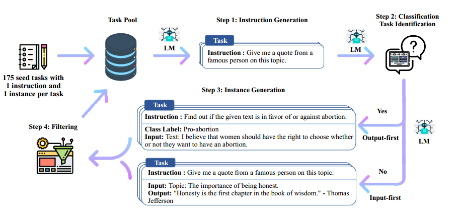
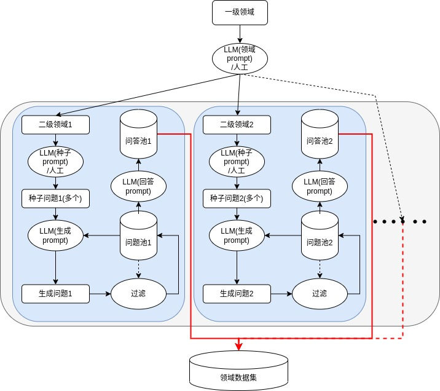

##

> 这篇笔记的重点角度不在于self-instruct的原本论文的内容，更多的在于对NLP应用的角度

# 一，self-instruct

## 1.主要流程

如上图：

1. 人工编写175条种子问题
2. 通过语言模型生成新的问题
3. 判断新的问题能不能当成分类任务
4. 如果可以分类，则先生成类别，然后生成对应的文本来提高多样性；如果不能分类，则输入问题然后获得响应的结果
5. 后过滤：判断生成问题与其他问题的相似度，如果太相似就去掉，不那么相似就添加到所有问答对中
6. 重复2-5直到数量够了

## 2.优缺点

### a.优点

1. 没数据的人可以通过其他的大语言模型获得数据
2. 可以根据生成时的prompt来影响大语言模型的生成结果

### b.缺点

1. 可调节的参数太多，不好控制最终效果，比如：种子问题的内容，prompt的内容，生成的总数量，后过滤方式和阈值等等
2. 对于针对性的问题或者领域数据仍然稀疏

# 二，一些NLP应用的思考

## 1.主要问题

1. 模型的效果取决于实际数据和训练方式，self-instruct本身产生的数据没有RLHF的对齐效果，只能对齐大模型和prompt本身
2. 针对性的NLP任务数据分两种，一种是业务本身就有的有数据方便标注或者自带标注的，一种是业务没有数据需要自己制造的。明显前者方便进行模型的迭代(将原先的LM升级成LLM)，而后者的问题较大，也是目前需求发展越来越大的，比如更智能的智能问答，更智能的智能对话

## 2.领域数据生成

> 智能问答：一问一答
>
> 智能对话：多轮对话

一问一答比如以前NLP任务中的FAQ，多轮对话比如任务型的多轮对话或者开放型的闲聊

相对于多轮对话，一问一答的数据比较好生成，也容易把以前的模型进行迭代，参考self-instruct数据还可以用大语言模型来辅助进行标注，一种领域数据生成思路如下：

