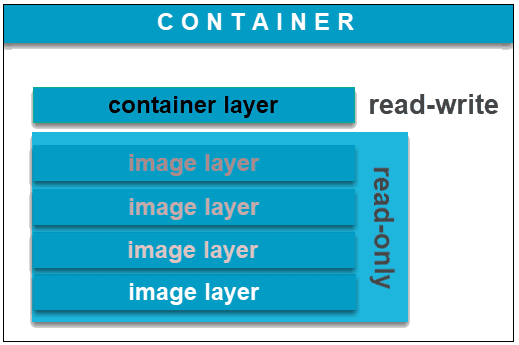
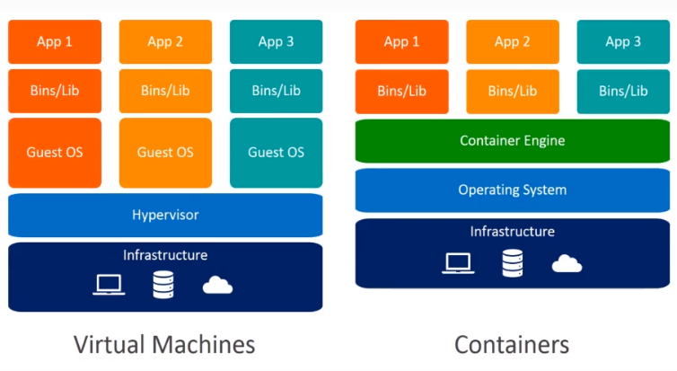
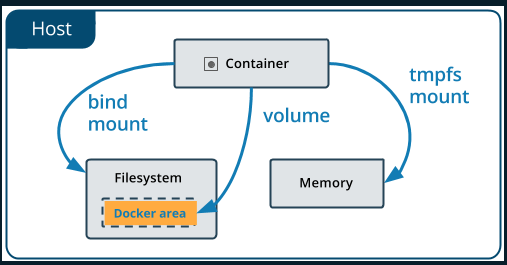
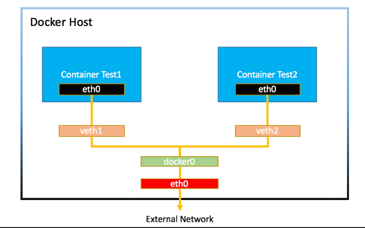
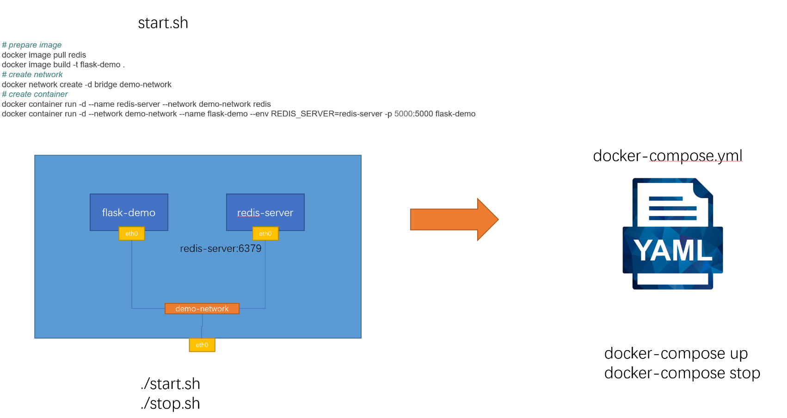

##
# 一、容器技术介绍

> 容器是一种技术，Docker是一个容器技术的实现，应用很广泛

## 1.什么是容器

容器是一种快速的打包技术

- 标准化
- 轻量级
- 易移植

# 二、容器快速上手

## 1.命令行介绍

1. 查看docker版本:`docker version`
1. 查看docker状态:docker info
1. 指令介绍：docker

## 2.镜像和容器

### ①image镜像

1. Docker image是一个read-only文件，这个文件包含文件系统、源码、库文件、工具等运行app所需要的文件
2. docker image有分层的概念

### ②container容器

1. 复制image并在image最上层加上一层read-write层（container layer层）
2. 基于同一个image可以创建多个container



### ③镜像的获取

1. 自己制作
2. 从registry(比如docker hub)

## 3.容器的基本操作

### ①创建、查看、停止、删除

| 操作                   | 命令（完整）                                     | 命令（简写）                           |
| ---------------------- | ------------------------------------------------ | :------------------------------------- |
| 容器的创建             | docker container run <image name>                | docker run <image name>                |
| 容器的查看(up)         | docker container ls                              | docker ps                              |
| 容器的查看(up 和 exit) | docker container ls -a                           | docker ps -a                           |
| 容器的停止             | docker container stop <name(全称) or ID(可简写)> | docker stop <name(全称) or ID(可简写)> |
| 容器的删除             | docker container rm <name(全称) or ID(可简写)>   | docker rm <name(全称) or ID(可简写)>   |

### ②小技巧

1. 批量操作

   > 通过 $(docker container ls -aq) 来获取所有容器的名字

```shell
# 批量启动
docker container start $(docker container ls -aq)
# 批量停止
docker container stop $(docker container ls -aq)
# 批量删除
docker container rm $(docker container ls -aq)
```

2. rm不能删除正在运行中的container问题

> 添加 -f参数

```shell
# 单个强制删除
docker container rm <name(全称) or ID(可简写)> -f
# 批量强制删除
docker container rm $(docker container ls -aq) -f
```

3. 删除已经推出的容器

```shell
docker container prune -f
```


## 4.容器的attached和detached模式

> attached模式与detached模式，前台执行与后台执行

1. 启动时尽量使用detached模式，免得不小心把container关了
2. 进入查看log尽量不用attached模式，同样免得不小心把container关了，用`docker container logs <name(全称) or ID(可简写)> `
3. 如果要进行交互，推荐使用交互模式

### ①detached模式启动与attached控制

```shell
# attached模式启动
docker container run (-it) <name(全称) or ID(可简写)> (sh)
# attached控制
docker attach <name(全称) or ID(可简写)>
# detached模式启动
docker container run -d <name(全称) or ID(可简写)>
```

### ②查看log

```shell
# 静态:暂时查看一次
docker container logs <name(全称) or ID(可简写)>
# 动态:持续查看
docker container logs <name(全称) or ID(可简写)> -f
```

## 5.容器的交互模式

> 启动容器时如果用attached模式退出后容器也跟着推出了，如果需要在容器中进行操作可以用detached启动，然后再用`exec`进入容器交互

```shell
docker container exec -it  <name(全称) or ID(可简写)> sh 
```

## 6.容器和虚拟机的区别



> 容器不是mini的虚拟机

1. 容器其实是进程Containers are just processes
2. 容器中的进程被限制了对CPU内存等资源的访问
3. 当进程停止后，容器就退出了

## 7.docker container run 发生的内容

`docker container run -d --p 80:80 nginx`

1. 在本地查找是否有nginx这个image镜像，但是没有发现
2. 去远程的image registry查找nginx镜像（默认的registry是Docker Hub)
3. 下载最新版本的nginx镜像 （nginx:latest 默认)
4. 基于nginx镜像来创建一个新的容器，并且准备运行
5. docker engine分配给这个容器一个虚拟IP地址
6. 在宿主机上打开80端口并把容器的80端口转发到宿主机上
7. 启动容器，运行指定的命令（这里是一个shell脚本去启动nginx）

# 三、镜像的创建管理和发布

## 1.镜像的获取方式

1. (online)从registry拉取: pull from registry(公有、私有)
2. (offline)从文件导入: load from file
3. (online)从Dockerfile构建: build from Dockerfile 
4. (online)从container提交: commit from container

## 2.常用的公有registry

- [Docker Hub Container Image Library | App Containerization](https://hub.docker.com/)
- [Quay Container Registry · Quay](https://quay.io/)

## 3.镜像的基本操作

### ①拉取方式获取镜像

| 操作                   | 指令                              |
| ---------------------- | --------------------------------- |
| 拉取                   | docker pull name(:tag)            |
| 查看镜像列表           | docker image ls                   |
| 查看某个镜像的详细信息 | docker image inspect <ID(可简写)> |
| 删除镜像               | docker image rm <ID(可简写)>      |
| 删除推出的镜像         | docker image prune -a             |

### ②导入方式获取镜像

| 操作         | 指令                                      |
| ------------ | ----------------------------------------- |
| 保存某个镜像 | docker image save  name:tag-o <路径+名字> |
| 载入某个镜像 | docker image load -i  <路径+名字>         |

### ③构建方式获取镜像

1. 编写Dockerfile: 各种细节下个章节总结,这里放一个例子

```dockerfile
FROM ubuntu:20.04
RUN apt-get update && \
    DEBIAN_FRONTEND=noninteractive apt-get install --no-install-recommends -y python3.9 python3-pip python3.9-dev
ADD hello.py /
CMD ["python3", "/hello.py"]
```


2. 构建镜像: `docker image build -t name:tag`

```shell
# 要是更换镜像名字可以用如下指令
docker image tag 原始name 新name
```

### ④提交方式获取镜像

1. 在container中进行操作
2. commit成新镜像: docker container commit <ID(可简写)>  <name(全称)>

### ⑤镜像分享到dockerhub

1. 登录: docker login
2. 推送: docker image push name


# 四、Dockerfile编写指南

 ## 1.FROM: 基础镜像的选择

### ①基本原则

1. 为了安全: 官方镜像优于非官方的镜像，如果没有官方镜像，则尽量选择Dockerfile开源的
2. 为了稳定: 固定版本tag而不是每次都使用latest
3. 节省空间: 尽量选择体积小的镜像

## 2.RUN: 执行指令

### ①简单例子

```dockerfile
# Dockerfile.bad的内容
FROM ubuntu:20.04
RUN apt-get update
RUN apt-get install -y wget
RUN wget https://github.com/ipinfo/cli/releases/download/ipinfo-2.0.1/ipinfo_2.0.1_linux_amd64.tar.gz
RUN tar zxf ipinfo_2.0.1_linux_amd64.tar.gz
RUN mv ipinfo_2.0.1_linux_amd64 /usr/bin/ipinfo
RUN rm -rf ipinfo_2.0.1_linux_amd64.tar.gz
```

```shell
# 构建指令
docker image build -f Dockerfile.bad -t ubuntu-bad
# 查看分层
docker image history <ID>
# 输出

```

> 每一行的RUN命令都会产生一层image layer, 导致镜像的臃肿,可以写在一起改进节约空间，分层多占用的空间是一些临时文件会保存在每个层中

### ②改进版

```dockerfile
# Dockerfile.good内容
FROM ubuntu:20.04
RUN apt-get update && \
    apt-get install -y wget && \
    wget https://github.com/ipinfo/cli/releases/download/ipinfo-2.0.1/ipinfo_2.0.1_linux_amd64.tar.gz && \
    tar zxf ipinfo_2.0.1_linux_amd64.tar.gz && \
    mv ipinfo_2.0.1_linux_amd64 /usr/bin/ipinfo && \
    rm -rf ipinfo_2.0.1_linux_amd64.tar.gz
```

## 3.COPY与ADD: 文件复制

1. `COPY` 和 `ADD` 都可以把local的一个文件复制到镜像里，如果目标目录不存在，则会自动创建。
2. `ADD` 比 COPY高级一点的地方就是，如果复制的是一个gzip等压缩文件时，ADD会帮助我们自动去解压缩文件。

```dockerfile
# 例子1
FROM python:3.9.5-alpine3.13
COPY hello.py /app/hello.py
# 例子2
FROM python:3.9.5-alpine3.13
ADD hello.tar.gz /app/
```


## 4.WORKDIR: 目录操作

1. 类似于`cd`指令，如果目标目录不存在，则会自动创建。

```dockerfile
# 例子
FROM python:3.9.5-alpine3.13
WORKDIR /app
COPY hello.py hello.py
```

## 5.ARG与ENV: 构建参数和环境变量

> `ARG` 和 `ENV` 是经常容易被混淆的两个Dockerfile的语法，都可以用来设置一个“变量”。 但实际上两者有很多的不同。

### ①例子

```dockerfile
# 原始dockerfile
FROM ubuntu:20.04
RUN apt-get update && \
    apt-get install -y wget && \
    wget https://github.com/ipinfo/cli/releases/download/ipinfo-2.0.1/ipinfo_2.0.1_linux_amd64.tar.gz && \
    tar zxf ipinfo_2.0.1_linux_amd64.tar.gz && \
    mv ipinfo_2.0.1_linux_amd64 /usr/bin/ipinfo && \
    rm -rf ipinfo_2.0.1_linux_amd64.tar.gz
    
# 使用ENV编写
FROM ubuntu:20.04
ENV VERSION=2.0.1
RUN apt-get update && \
    apt-get install -y wget && \
    wget https://github.com/ipinfo/cli/releases/download/ipinfo-${VERSION}/ipinfo_${VERSION}_linux_amd64.tar.gz && \
    tar zxf ipinfo_${VERSION}_linux_amd64.tar.gz && \
    mv ipinfo_${VERSION}_linux_amd64 /usr/bin/ipinfo && \
    rm -rf ipinfo_${VERSION}_linux_amd64.tar.gz
    
# 使用ARG编写
FROM ubuntu:20.04
ARG VERSION=2.0.1
RUN apt-get update && \
    apt-get install -y wget && \
    wget https://github.com/ipinfo/cli/releases/download/ipinfo-${VERSION}/ipinfo_${VERSION}_linux_amd64.tar.gz && \
    tar zxf ipinfo_${VERSION}_linux_amd64.tar.gz && \
    mv ipinfo_${VERSION}_linux_amd64 /usr/bin/ipinfo && \
    rm -rf ipinfo_${VERSION}_linux_amd64.tar.gz
```

1. ARG 可以在镜像build的时候动态修改value, 通过 `--build-arg`
2. ENV 设置的变量可以在Image中保持，并在容器中的环境变量里


```dockerfile
# 构建时修改ARG例子
$ docker image build -f .\Dockerfile-arg -t ipinfo-arg-2.0.0 --build-arg VERSION=2.0.0 .
$ docker image ls
REPOSITORY         TAG       IMAGE ID       CREATED          SIZE
ipinfo-arg-2.0.0   latest    0d9c964947e2   6 seconds ago    124MB
$ docker container run -it ipinfo-arg-2.0.0
root@b64285579756:/#
root@b64285579756:/# ipinfo version
2.0.0
root@b64285579756:/#
```

## 6.CMD: 容器启动命令1

1. 容器启动时默认执行的命令
2. 如果docker container run启动容器时指定了其它命令，则CMD命令会被忽略
3. 如果定义了多个CMD，只有最后一个会被执行。

```shell
# ubuntu中自带的CMD指令
IMAGE          CREATED         CREATED BY                                      SIZE      COMMENT
26b77e58432b   19 months ago   /bin/sh -c #(nop)  CMD ["/bin/bash"]            0B
<missing>      19 months ago   /bin/sh -c mkdir -p /run/systemd && echo 'do…   7B
<missing>      19 months ago   /bin/sh -c [ -z "$(apt-get indextargets)" ]     0B
<missing>      19 months ago   /bin/sh -c set -xe   && echo '#!/bin/sh' > /…   811B
<missing>      19 months ago   /bin/sh -c #(nop) ADD file:27277aee655dd263e…   72.9MB

```

## 7.ENTRYPOINT: 容器启动命令2

1. `CMD` 设置的命令，可以在`docker container run` 时传入其它命令，覆盖掉 `CMD` 的命令，但是 `ENTRYPOINT` 所设置的命令是一定会被执行的。
2. `ENTRYPOINT` 和 `CMD` 可以联合使用，`ENTRYPOINT` 设置执行的命令，`CMD`传递参数

```dockerfile
# 单独用CMD
FROM ubuntu:20.04
CMD ["echo", "hello docker"]
# 单独用ENTRYPOINT
FROM ubuntu:20.04
ENTRYPOINT ["echo", "hello docker"]
# 通过dockerfile组合ENTRYPOINT和CMD
FROM ubuntu:20.04
ENTRYPOINT ["echo", "hello docker"]
CMD ["what's up"]
# 通过命令行组合ENTRYPOINT和CMD
FROM ubuntu:20.04
ENTRYPOINT ["echo", "hello docker"]
$ docker container run -it --rm demo-both-cmd echo "hello world"
hello docker echo hello world
```

## 8.Shell格式与Exec格式: 容器启动命令3

> 用Exec格式比较多

### ①shell格式

```dockerfile
CMD echo "hello docker"
ENTRYPOINT echo "hello docker"
```

### ②Exec格式

```dockerfile
CMD ["echo", "hello docker"]
ENTRYPOINT ["echo", "hello docker"]
```

### ③传参问题

```dockerfile
# 能引用
FROM ubuntu:20.04
ENV NAME=docker
CMD echo "hello $NAME"

# 不能引用
FROM ubuntu:20.04
ENV NAME=docker
CMD ["echo", "hello $NAME"]

# 能引用
FROM ubuntu:20.04
ENV NAME=docker
CMD ["sh", "-c", "echo hello $NAME"]
```


## 9.Dockerfile技巧(最佳实践)

### ①合理使用缓存

1. 镜像构建一次后会有缓存，如果之后没有更改可以使用缓存减少构建时间
2. 如果靠前的层改变了，之后的缓存都不起作用，可以把不常改变的指令放前面，经常改变的指令放后面来节省构建时间

```shell
## Dockerfile修改前
FROM python:3.9.5-slim
COPY hello.py /src/hello.py
EXPOSE 5000
RUN pip install flask
WORKDIR /src
ENV FLASK_APP=app.py
CMD ["flask", "run", "-h", "0.0.0.0"]
# 第一次构建
 => [2/4] COPY hello.py /src/hello.py                 
 => [3/4] RUN pip install flask                       
 => [4/4] WORKDIR /src 
# 第二次构建(使用了cached)
 => CACHED [2/4] COPY hello.py /src/hello.py           
 => CACHED [3/4] RUN pip install flask                 
 => CACHED [4/4] WORKDIR /src    
#修改hello.py内容后本层和之后的缓存都将失效
 => CACHED [1/4] FROM docker.io/library/python:3.9.5-slim@sha256:9828573e...
 => [2/4] COPY hello.py /src/hello.py                 
 => [3/4] RUN pip install flask                       
 => [4/4] WORKDIR /src
 
## Dockerfile修改后
FROM python:3.9.5-slim
EXPOSE 5000
RUN pip install flask
WORKDIR /src
ENV FLASK_APP=app.py
COPY hello.py /src/hello.py
CMD ["flask", "run", "-h", "0.0.0.0"]
 #调换指令顺序后修改hello.py内容后之前的缓存有效
 => [1/4] FROM docker.io/library/python:3.9.5-slim@sha256:9828573e6a0b02b6...                       
 => CACHED [2/4] RUN pip install flask                 
 => CACHED [3/4] WORKDIR /src                         
 => [4/4] COPY hello.py /src/hello.py   
```

### ②合理使用.dockerignore

1. Docker是client-server架构，理论上Client和Server可以不在一台机器上。

2. 在构建docker镜像的时候，需要把所需要的文件由CLI（client）发给Server，这些文件实际上就是build context
3. 可以通过.dockerignore来减少内容

### ③镜像的多阶段构建

如果需要编译环境或中间文件过多可以试用多阶段构建来把这些步骤放在前面的阶段来节约docker image空间

```dockerfile
# 单阶段例子
FROM gcc:9.4

COPY hello.c /src/hello.c

WORKDIR /src

RUN gcc --static -o hello hello.c

ENTRYPOINT [ "/src/hello" ]

CMD []

# 多阶段例子
FROM gcc:9.4 AS builder

COPY hello.c /src/hello.c

WORKDIR /src

RUN gcc --static -o hello hello.c


FROM alpine:3.13.5

COPY --from=builder /src/hello /src/hello

ENTRYPOINT [ "/src/hello" ]

CMD []
```

### ④使用非root用户

用非root保证一些安全性问题

```dockerfile
# root权限例子(常用)
FROM python:3.9.5-slim

RUN pip install flask

COPY app.py /src/app.py

WORKDIR /src
ENV FLASK_APP=app.py

EXPOSE 5000

CMD ["flask", "run", "-h", "0.0.0.0"]

# 创建用户并使用用户
FROM python:3.9.5-slim

RUN pip install flask && \
    groupadd -r flask && useradd -r -g flask flask && \
    mkdir /src && \
    chown -R flask:flask /src

USER flask

COPY app.py /src/app.py

WORKDIR /src
ENV FLASK_APP=app.py

EXPOSE 5000

CMD ["flask", "run", "-h", "0.0.0.0"]
```

# 五、docker的存储

> 问题：
>
> 默认情况下，在运行中的容器里创建的文件，被保存在一个可写的容器层：
>
> - 如果容器被删除了，则数据也没有了
> - 这个可写的容器层是和特定的容器绑定的，也就是这些数据无法方便的和其它容器共享
>
> 
>
> 解决方法：
>
> Docker主要提供了两种方式做数据的持久化
>
> - Data Volume, 由Docker管理，(/var/lib/docker/volumes/ Linux), 持久化数据的最好方式
> - Bind Mount，由用户指定存储的数据具体mount在系统什么位置
>
> 

## 1.Data Volume

### ①在Dockerfile中添加volume指令

再一次构建同一个镜像的时候不会继续使用这个volume

```dockerfile
FROM alpine:latest
RUN apk update
RUN apk --no-cache add curl
ENV SUPERCRONIC_URL=https://github.com/aptible/supercronic/releases/download/v0.1.12/supercronic-linux-amd64 \
    SUPERCRONIC=supercronic-linux-amd64 \
    SUPERCRONIC_SHA1SUM=048b95b48b708983effb2e5c935a1ef8483d9e3e
RUN curl -fsSLO "$SUPERCRONIC_URL" \
    && echo "${SUPERCRONIC_SHA1SUM}  ${SUPERCRONIC}" | sha1sum -c - \
    && chmod +x "$SUPERCRONIC" \
    && mv "$SUPERCRONIC" "/usr/local/bin/${SUPERCRONIC}" \
    && ln -s "/usr/local/bin/${SUPERCRONIC}" /usr/local/bin/supercronic
COPY my-cron /app/my-cron
WORKDIR /app

VOLUME ["/app"]  # 会将/app下的文件存储在volume位置，可以用docker volume ls照看当前的volume name，然后用docker volume inspect <volume name>来开看具体位置然后查看里面的内容

# RUN cron job
CMD ["/usr/local/bin/supercronic", "/app/my-cron"]
```

### ②创建容器时指定使用volume的名字和目录，没有时则创建并使用

```dockerfile
FROM alpine:latest
RUN apk update
RUN apk --no-cache add curl
ENV SUPERCRONIC_URL=https://github.com/aptible/supercronic/releases/download/v0.1.12/supercronic-linux-amd64 \
    SUPERCRONIC=supercronic-linux-amd64 \
    SUPERCRONIC_SHA1SUM=048b95b48b708983effb2e5c935a1ef8483d9e3e
RUN curl -fsSLO "$SUPERCRONIC_URL" \
    && echo "${SUPERCRONIC_SHA1SUM}  ${SUPERCRONIC}" | sha1sum -c - \
    && chmod +x "$SUPERCRONIC" \
    && mv "$SUPERCRONIC" "/usr/local/bin/${SUPERCRONIC}" \
    && ln -s "/usr/local/bin/${SUPERCRONIC}" /usr/local/bin/supercronic
COPY my-cron /app/my-cron
WORKDIR /app

# RUN cron job
CMD ["/usr/local/bin/supercronic", "/app/my-cron"]
```

```shell
# 创建镜像
docker container run -d -v cron-data:/app my-cron
```

### ③存储清理

```shell
$ docker rm -f $(docker container ps -aq)
$ docker system prune -f
$ docker volume prune -f
```

## 2.Bind Mount

> data volume路径指定在了linux下的文件夹，bind mount方式可以直接绑定到某个路径

```shell
# dockerfile接上面，创建镜像
docker container run -d -v ${pwd}:/app my-cron
```

# 六、docker的网络

## 1.IP地址的查看

```bash
# windows
ipconfig
# linux
ifconfig
或者
ip addr
```

## 2.网络连通性测试

### ①ping命令

```
# 测试ip地址是否联通
ping 127.0.0.1
```

### ②telnet命令

```
# 测试端口是否联通
telnet www.baidu.com 80
```

## 3.抛出疑问

1. 为什么本地可以直接ping通docker的ip地址？
2. 为什么容器中可以直接ping通外部网络？
3. 为什么本地两个容器之间可以ping通？
4. 为什么外部机器不能ping通本地的容器地址?
5. 容器的ip地址是怎么分配的？

### ①为什么本地可以直接ping通docker的ip地址？

```bash
# 查看docker的网络
docker network ls
# 查看bridge网络
docker inspect XXX(bridge的NAME ID)或者bridge NAME
```



ubuntu通过 `apt-get install -y bridge-utils`来安装brctl，可以查看本地的bridge网络

### ②为什么容器中可以直接ping通外部网络？

因为通过NAT转发出去

> 公有IP地址不能让每台电脑都有个IP地址，后来发明了私有IP地址是可以重复使用的，但是私有IP地址不能直接访问公有网络，所以通过NAT把私有IP转换成公有IP在互联网中使用，然后再用公有IP传回私有IP获得结果

### ③为什么本地两个容器之间可以ping通？

如果这两个容器在同一个bridge网络中就可以互相ping通，如果自己创建bridge网络然后把容器添加进去可以使用DNS解析功能(自己创建才自带的功能，默认创建不带)也就是直接使用容器的名字来进行请求

### ④为什么外部机器不能ping通本地的容器地址?

因为外部请求不能通过host网络直接请求到私有IP地址。

解决方法：

1. 可以通过端口转发出来直接请求本地机器的某个端口

`docker container run -d --rm --name -p 8080:80 web nginx`

在Dockerfile中可以使用EXPOSE PortID来提示对外暴露的端口，方便使用人员查看

2. 可以直接将docker的网络挂在host网络上使用
3. `docker container run -d --rm network -- name web nginx`

> 补充：还有一种none网络，个人开发者一般不用，常用于容器编排或者其他工具，网络自行来配置

# 七、docker-compose

## 1.docker-compose是什么



## 2.docker-compose安装

### ①windows与mac

安装docker-desktop后，docker-compose默认自动安装

```bash
# 查看docker-compose版本
docker-compose --version
```

### ②linux

```bash
# 通过指令安装
$ sudo curl -L "https://github.com/docker/compose/releases/download/1.29.2/docker-compose-$(uname -s)-$(uname -m)" -o /usr/local/bin/docker-compose
$ sudo chmod +x /usr/local/bin/docker-compose
$ docker-compose --version
```

### ③通过pip安装

```bash
pip install docker-compose
```

## 3.compose文件的结构和版本

> 语法说明:[Compose specification | Docker Documentation](https://docs.docker.com/compose/compose-file/)
>
> 版本相关信息:[Compose file versions and upgrading | Docker Documentation](https://docs.docker.com/compose/compose-file/compose-versioning/)
>
> Compose文件是一个YAML文件，为Docker应用程序定义服务、网络和卷。

### ①基本语法结构

一个样板

```yaml
version: "3.8"

services: # 容器
  servicename: # 服务名字，这个名字也是内部 bridge网络可以使用的 DNS name
    image: # 镜像的名字
    command: # 可选，如果设置，则会覆盖默认镜像里的 CMD命令
    environment: # 可选，相当于 docker run里的 --env
    volumes: # 可选，相当于docker run里的 -v
    networks: # 可选，相当于 docker run里的 --network
    ports: # 可选，相当于 docker run里的 -p
  servicename2:

volumes: # 可选，相当于 docker volume create

networks: # 可选，相当于 docker network create
```

一个例子

```bash
# 原来需要的三个步骤 
## prepare image
docker image pull redis
docker image build -t flask-demo .

## create network
docker network create -d bridge demo-network

## create container
docker container run -d --name redis-server --network demo-network redis
docker container run -d --network demo-network --name flask-demo --env REDIS_HOST=redis-server -p 5000:5000 flask-demo
```

```shell
# 修改成docker-compose.yml
version: "3.8"

services:
  flask-demo:
    image: flask-demo:latest
    environment:
      - REDIS_HOST=redis-server
    networks:
      - demo-network
    ports:
      - 8080:5000

  redis-server:
    image: redis:latest
    networks:
     - demo-network

networks:
  demo-network:
```

### ②基本命令

| 操作               | 命令                   | 说明                                                         |
| ------------------ | ---------------------- | ------------------------------------------------------------ |
| 前台启动           | docker-compose up      | 需要在当前的yaml的路径下，不然要通过-f来指定对应文件路径     |
| 后台启动           | docker-compose up -d   | 支持的文件(Supported filenames): docker-compose.yml, docker-compose.yaml, compose.yml, compose.yaml |
| 后台情况下查看日志 | docker-compose logs    |                                                              |
| 持续查看           | docker-compose logs -f |                                                              |
| 查看               | docker-compose ps      |                                                              |
| 停止               | docker-compose stop    |                                                              |
| 删除               | docker-compose rm      |                                                              |
| 提前拉取镜像       | docker-compose pull    |                                                              |

### ③docker-compose镜像构建和拉取

```yaml
# 从本地来build镜像
# 修改成docker-compose.yml
version: "3.8"

services:
  flask-demo:
  	build:
  	  context: ./flask
  	  dockerfile: Dockerfile
    image: flask-demo:latest
    environment:
      - REDIS_HOST=redis-server
    networks:
      - demo-network
    ports:
      - 8080:5000

  redis-server:
    image: redis:latest
    networks:
     - demo-network

networks:
  demo-network:
```

### ④docker-compose服务更新

1. 如果需要docker-compose中需要的build的部分有修改可以通过执行`docker-compose up -d --build` 来自动build已经修改的部分来更新服务
2. 如果有修改一些配置可以通过执行`docker-compose restart`来重启容器
3. 如果有些服务已经在docker-compose中没有了可以通过执行 `docker-compose remove-orphans`来删除没用的容器

## 4.compose网络

单机的docker-compose默认driver是bridge网络

## 5.水平扩展和负载均衡

```bash
docker-compose up -d --scale services_name=N
```

水平扩展某个服务后docker-compose会自动做负载均衡

## 6.环境变量

### ①通过environment来设定

```bash
version: "3.8"

services:
  flask:
    build:
      context: ./flask
      dockerfile: Dockerfile
    image: flask-demo:latest
    environment:
      - REDIS_HOST=redis-server
      - REDIS_PASS=${REDIS_PASSWORD}
    networks:
      - backend
      - frontend

  redis-server:
    image: redis:latest
    command: redis-server --requirepass ${REDIS_PASSWORD}
    networks:
      - backend

  nginx:
    image: nginx:stable-alpine
    ports:
      - 8000:80
    depends_on:
      - flask
    volumes:
      - ./nginx/nginx.conf:/etc/nginx/conf.d/default.conf:ro
      - ./var/log/nginx:/var/log/nginx
    networks:
      - frontend

networks:
  backend:
  frontend:
```

### ②通过env_file来传入

```
# .env文件内容
REDIS_PASSWORD=ABC123

# 然后通过命令行执行
docker-compose --env-file ./.env up(或者config来配置)
```

## 7.服务依赖与健康检查

### ①服务依赖

有些服务之间有相互依赖的启动顺序关系，可以通过 `depends_on`关键字来设置

```yaml
version: "3.8"

services:
  flask:
    build:
      context: ./flask
      dockerfile: Dockerfile
    image: flask-demo:latest
    environment:
      - REDIS_HOST=redis-server
      - REDIS_PASS=${REDIS_PASSWORD}
    healthcheck:
      test: ["CMD", "curl", "-f", "http://localhost:5000"]
      interval: 30s
      timeout: 3s
      retries: 3
      start_period: 40s
    depends_on:
      redis-server:
        condition: service_healthy
    networks:
      - backend
      - frontend

  redis-server:
    image: redis:latest
    command: redis-server --requirepass ${REDIS_PASSWORD}
    healthcheck:
      test: ["CMD", "redis-cli", "ping"]
      interval: 1s
      timeout: 3s
      retries: 30
    networks:
      - backend

  nginx:
    image: nginx:stable-alpine
    ports:
      - 8000:80
    depends_on:
      flask:
        condition: service_healthy
    volumes:
      - ./nginx/nginx.conf:/etc/nginx/conf.d/default.conf:ro
      - ./var/log/nginx:/var/log/nginx
    networks:
      - frontend

networks:
  backend:
  frontend:
```

### ②健康检查

Dockerfile healthcheck:[Dockerfile reference | Docker Documentation](https://docs.docker.com/engine/reference/builder/#healthcheck)

Docker compose healthcheck:[Compose file version 3 reference | Docker Documentation](https://docs.docker.com/compose/compose-file/compose-file-v3/#healthcheck)

# 八、docker-swarm

> 生产环境中需要高可靠性，docker-compose如果出现单节点故障就凉凉

## 1.swarm基本操作

1. 查看服务: `docker service ls`
2. 查看服务的容器信息: `docker service ps 5ev`
3. 创建一个nginx的服务: `docker service create nginx:latest`
4. 服务扩展: `docker service update 5ev --replicas 3` (这里swarm会自动启动新的挂掉的容器)
5. 删除服务: `docker service rm 5ev`
6. 查看日志: `docker service 5ev logs  持续查看docker service 5ev logs -f`
7. 查看节点基本信息: `docker node ls`
8. 查看机器的详细信息: `docker inspect 5ev`

## 2.overlay网络

> swarm的网络重要的两点
>
> - 第一是外部如何访问部署运行在swarm集群内的服务，可以称之为 `入方向` 流量，在swarm里我们通过 `ingress` 来解决
> - 第二是部署在swarm集群里的服务，如何对外进行访问，这部分又分为两块:
>   - 第一，`东西向流量` ，也就是不同swarm节点上的容器之间如何通信，swarm通过 `overlay` 网络来解决；
>   - 第二，`南北向流量` ，也就是swarm集群里的容器如何对外访问，比如互联网，这个是 `Linux bridge + iptables NAT` 来解决的
>
> 
>
> 类似于bridge连接，解决不同主机之间的容器间数据互联的网络问题


1. 创建overlay网络: `docker network create -d overlay mynet`
2. 创建服务: `docker service create --network mynet --name test --replicas 2 busybox ping 8.8.8.8`

## 3.ingress网络

docker swarm的ingress网络又叫 `Ingress Routing Mesh`

主要是为了实现把service的服务端口对外发布出去，让其能够被外部网络访问到。

ingress routing mesh是docker swarm网络里最复杂的一部分内容，包括多方面的内容：

- iptables的 Destination NAT流量转发
- Linux bridge, network namespace
- 使用IPVS技术做负载均衡
- 包括容器间的通信（overlay）和入方向流量的端口转发

## 4.部署多service应用

> docker-compose多用于开发测试环境，可以build镜像，swarm多用于生产环境，不能build镜像，通过stack来启动服务

通过stack启动服务

`env REDIS_PASSWORD=ABC123 docker stack deploy --compose-file docker-compose.yml flask-demo`

## 5.在swarm中使用secret(pass)

## 6.在swarm使用本地volume(pass)

# 九、docker的多架构支持


